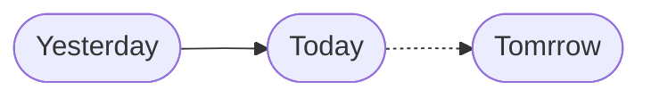

# hello-modern-world
Learning new tools in anticipation of the new normal.

## Everything is changing
Today is 2020-04-05 and like yesterday, everything is changing. Tomorrow, everything will change again. 

Questions for today:

- How do you keep up with this kind of change?
- In two years, what will you wish you had paid attention to?

---

